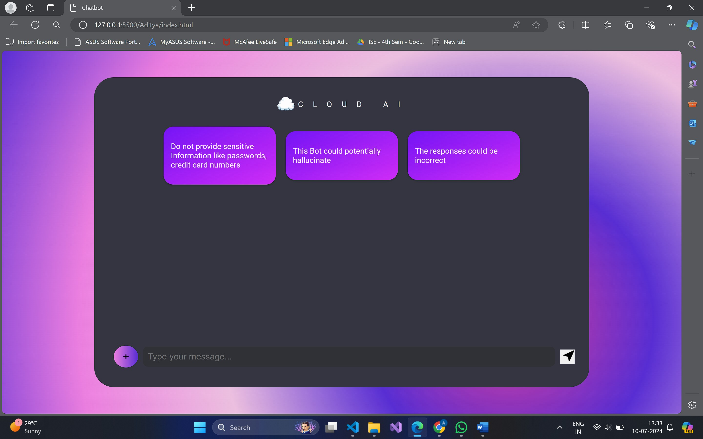
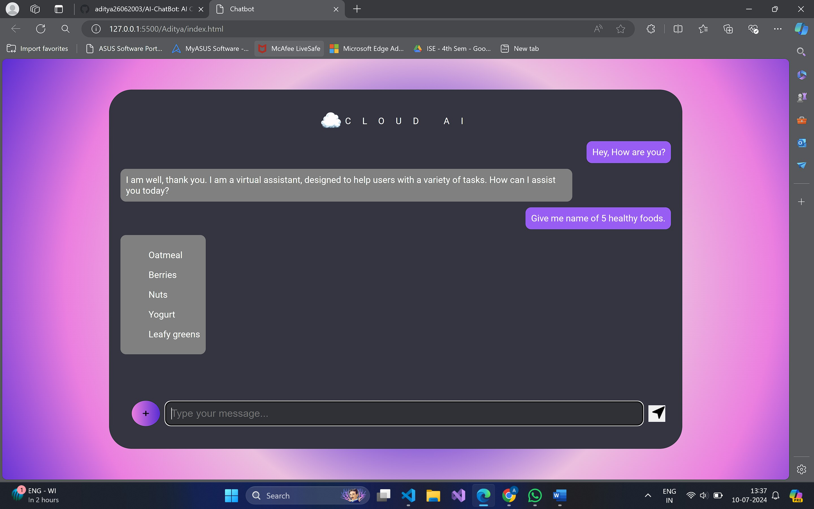
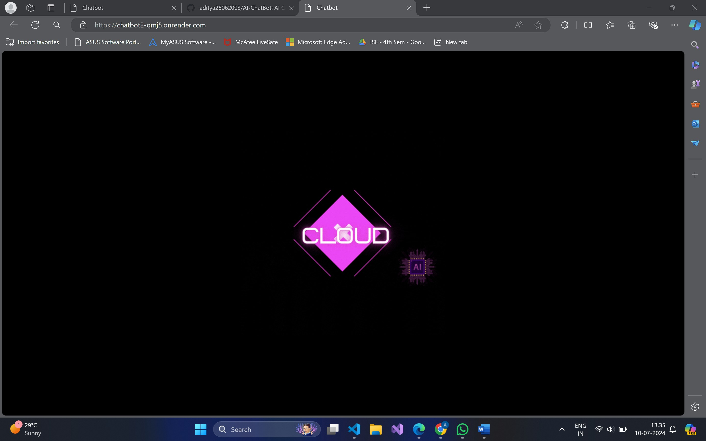

# ChatBot Web Project 🤖💬

This repository contains the code and resources for the ChatBot Web Project, a web-based chatbot application.

Live Demo :: [Run](https://chat-bot-web-project.vercel.app/)

## Project Structure 📁

```
ChatBot_WebProject/
├── output_images/
│   ├── one.jpg
│   ├── three.jpg
│   ├── two.jpg
│   └── use case.png
├── public/
│   ├── Images/
│   │   ├── chat.js
│   |   ├── index.html
│   │   └── styles.css
├── report files/
│   ├── WEB_DEVELOPMENT_LAB_Mini_Project_Report-4th sem-combined FINAL.docx
│   └── WEB_DEVELOPMENT_LAB_Mini_Project_Report-4th sem-combined FINAL.pdf
├── .gitignore
├── README.md
├── chatbot.db
├── package-lock.json
├── package.json
└── server.js
```

### Folders and Files

- **output_images/** 📷
  - `one.jpg` 
  - `three.jpg` 
  - `two.jpg` 
  - `use case.png` 
- **public/** 🌐
  - **Images/** 🖼️
    - `chat.js` 📄
    - `index.html` 🌍
    - `styles.css` 🎨
- **report files/** 📝
  - `WEB_DEVELOPMENT_LAB_Mini_Project_Report-4th sem-combined FINAL.docx` 📄
  - `WEB_DEVELOPMENT_LAB_Mini_Project_Report-4th sem-combined FINAL.pdf` 📄
- `.gitignore` ❌
- `README.md` 📘
- `chatbot.db` 🗄️
- `package-lock.json` 📦
- `package.json` 📦
- `server.js` 🖥️

## Getting Started 🚀

To get a local copy up and running follow these simple steps.

### Prerequisites

You need to have Node.js and npm installed on your machine. You can download them from [here](https://nodejs.org/).

### Installation

1. Clone the repo

```sh
git clone https://github.com/EchoSingh/AI-ChatBot.git
```

2. Navigate to the project directory

```sh
cd ChatBot_WebProject
```

3. Install NPM packages

```sh
npm install
```

4. Start the server

```sh
node server.js
```

## Usage

Once the server is running, you can access the chatbot application by navigating to `http://localhost:3000` in your web browser.


## Report Files 📝

The project reports are available in the `report files` directory:

- [WEB_DEVELOPMENT_LAB_Mini_Project_Report-4th sem-combined FINAL.docx](report%20files/WEB_DEVELOPMENT_LAB_Mini_Project_Report-4th%20sem-combined%20FINAL.docx)
- [WEB_DEVELOPMENT_LAB_Mini_Project_Report-4th sem-combined FINAL.pdf](report%20files/WEB_DEVELOPMENT_LAB_Mini_Project_Report-4th%20sem-combined%20FINAL.pdf)


## License 📄

Distributed under the MIT License. See `LICENSE` for more information.

## Made with ❤️ by Aditya Singh
